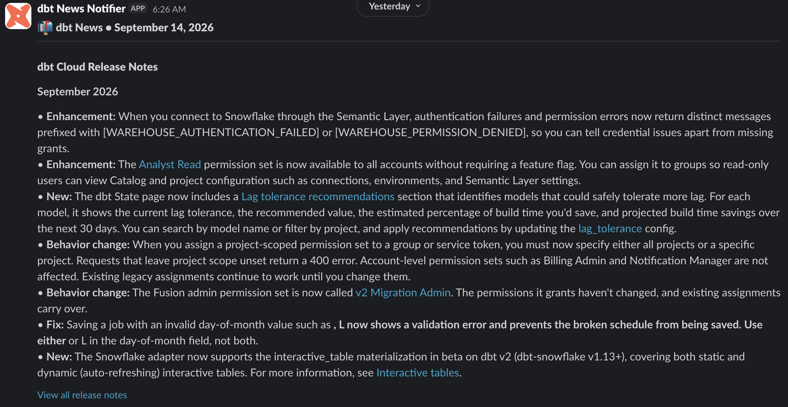
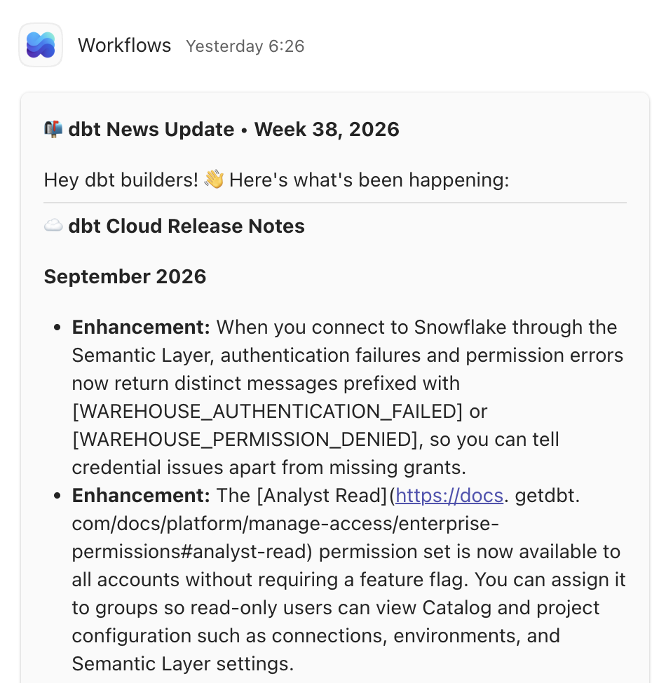

# newswire

 

A config-driven news notifier: point it at sources (GitHub releases, discussions, blogs,
release-notes pages), it checks what is new and posts a digest to your channels (Slack,
Microsoft Teams). One YAML config decides everything; the shipped example follows the dbt
ecosystem, but nothing dbt-specific lives in the code — point it at Airflow or Kubernetes instead.

Current version: **1.0.0** — stable, used in production for the dbt digest in this repo.

## Contents

- [What you get](#what-you-get)
- [Quickstart](#quickstart)
- [How it works](#how-it-works)
- [Documentation](#documentation)
- [Development](#development)
- [License](#license)

## What you get

An automatically received newsletter about (not only) dbt news — delivered to the channels your
team already reads, no inbox and no subscription.

One scheduled run, one digest per channel — the shipped dbt config posting to Slack and Teams:

### Slack



### Microsoft Teams



Sections, their order and their emoji come from the `sources` list in your config; each channel
renders them natively (Block Kit vs Adaptive Card).

## Quickstart

Try it in two minutes: one source, one Slack channel, state in a local JSON file — no GitHub
Gist, no tokens.

1. Install:
   ```bash
   uv sync
   ```
2. Create `config.yml`:
   ```yaml
   state:
     backend: local_file
     options:
       path: state.json

   sources:
     - id: dbt-core-releases
       type: github_releases
       title: "dbt-core"
       emoji: "🚀"
       options:
         repo: dbt-labs/dbt-core

   notifiers:
     - id: slack
       type: slack
       options:
         webhook_url: ${SLACK_WEBHOOK_URL}
   ```
3. Fill `SLACK_WEBHOOK_URL` in `.env`. **For a dry run any placeholder does** — nothing is sent,
   but the variable has to exist, or the config fails to load:
   ```bash
   echo 'SLACK_WEBHOOK_URL=https://example.invalid/dry-run' > .env
   ```
   Ready for a real channel? [Create a Slack webhook](docs/guides/slack.md) and paste it here
   instead.
4. Dry run — fetches and renders, sends nothing, writes no state. Redirect it to a file to read
   the digest without any channel at all:
   ```bash
   uv run newswire --dry-run > digest.txt
   ```
   `digest.txt` holds what each notifier would have posted, section by section.
5. Real run — posts the newest dbt-core release and remembers it in `state.json`:
   ```bash
   uv run newswire
   ```

Run it again: nothing new, so it posts a "no news" message. Delete `state.json` (or edit its
`cursor`) to replay. From here, add sources and channels from
[`config.example.yml`](config.example.yml) — it shows every available type, commented.

Deploy it on a schedule: [GitHub Actions](docs/guides/github-actions.md) (primary, with the
`github_gist` state backend so state survives runners) or [Docker + cron](docs/guides/docker.md).

## How it works

```
sources (fetch + diff against state) ──> per-notifier digest ──> channels
                └── state backend remembers what was already sent
```

- **Sources**: `github_releases`, `github_discussions`, `docusaurus_blog`, `html_list`,
  `dbt_cloud_release_notes` — [reference](docs/reference/sources.md)
- **Notifiers**: `slack`, `teams` — [reference](docs/reference/notifiers.md)
- **State**: `github_gist` or `local_file` — [reference](docs/reference/state.md)
- **Routing**: each source picks its channels with `notify:` — [routing](docs/routing.md)
- Digest section order = the order of the `sources` list. No hardcoded ordering.

## Documentation

Everything lives in [docs/](docs/index.md). Most-visited pages:
[configuration](docs/configuration.md) · [env vars](docs/reference/env-vars.md) ·
[troubleshooting](docs/troubleshooting.md) · [add a source](docs/add-a-source.md)

## Development

```bash
uv sync                 # install incl. dev tools
uv run pytest           # tests (network is mocked)
uv run ruff check .     # lint
uv run ruff format .    # format
```

Contributions: see [CONTRIBUTING.md](CONTRIBUTING.md). Releases: [docs/releasing.md](docs/releasing.md).

## License

[MIT](LICENSE)
